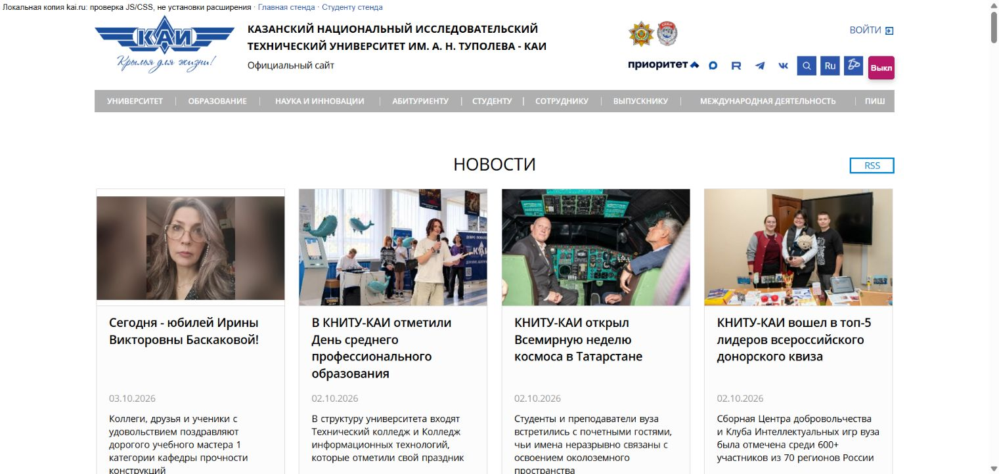
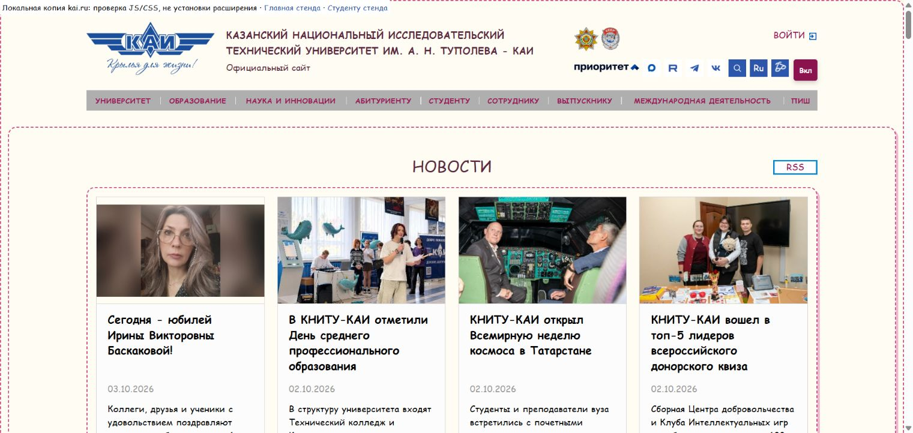
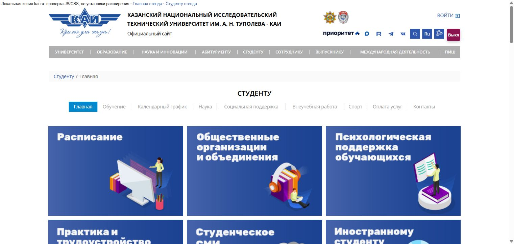
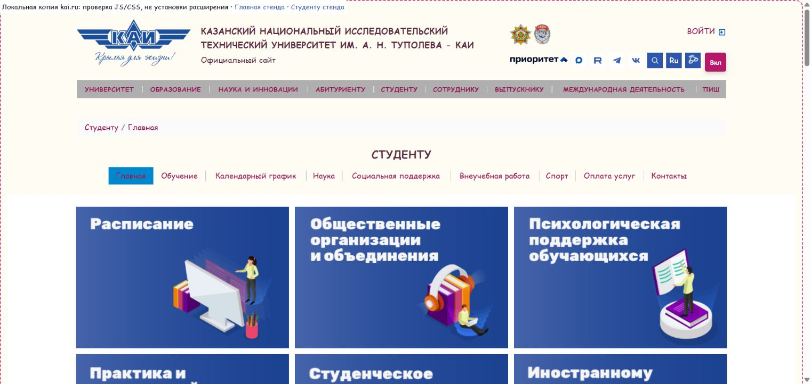

# KAI Comic Sans Theme

Лабораторная работа 2, студент 20, вариант 10: **Comic Sans Everything**.

Расширение добавляет компактную кнопку «Вкл / Выкл» справа в шапке kai.ru, рядом со значками. Подсказка показывает полный статус Comic Sans. Кнопка переключает шрифт на Comic Sans и меняет фон, цвет текста, межбуквенный интервал, высоту строки, рамки, скругления, тени и отступы. Выключение возвращает оформление сайта.

Состояние сохраняется в `localStorage` и восстанавливается после перезагрузки и перехода на другую страницу того же домена. Кнопка работает мышью, Enter и пробелом.

## Установка

1. Откройте `chrome://extensions/` в Google Chrome или Яндекс.Браузере.
2. Включите режим разработчика и нажмите «Загрузить распакованное расширение».
3. Выберите папку `lab2-dom/solutions/student-20/style-plugin`.
4. Откройте [kai.ru](https://kai.ru/) и нажмите кнопку справа в шапке. Если страница уже открыта, перезагрузите её.

## Проверка

Включите тему на главной, перезагрузите страницу и перейдите в раздел [«Студенту»](https://kai.ru/web/studentu). Тема должна остаться включённой. Выключите её и повторите перезагрузку: исходное оформление должно сохраниться.

В коде используются `getElementById`, `querySelector`, `querySelectorAll`, `parentElement` и `children`. Сложный селектор выбирает `.news_box` и `.box_items` внутри `#page_wrapper`. Стили применяются через CSS-классы.

## Примеры

Ниже — скриншоты ручной проверки JS/CSS на локальных копиях главной и страницы «Студенту». Клик, Enter, пробел, сохранение состояния и восстановление стилей проверены. Установленное расширение также проверено вручную на kai.ru.

### Главная

### Студенту

